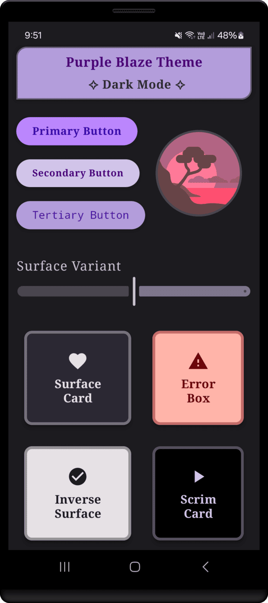
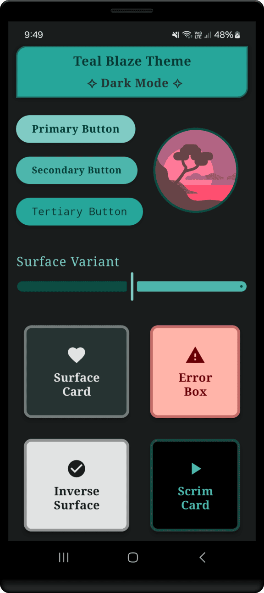

<h1 align="center" >Android Canvas Themes <br>♨ [ ᴀɴᴅʀᴏɪᴅ ʟɪʙʀᴀʀʏ ] ♨</h1>

## ɪ  ⁃  ᴀʙᴏᴜᴛ ᴀɴᴅʀᴏɪᴅ ʟɪʙʀᴀʀʏ

Android Canvas Themes is a Kotlin library that offers a range of Material Design inspired color themes for Android apps. It includes multiple ready to use themes and supports both light and dark modes, making it easy for developers to design visually appealing user interfaces.
<br>

<div align="center">

⁃ ᴄᴏɴᴛᴇɴᴛꜱ ⁃

[ɪɴꜱᴛᴀʟʟᴀᴛɪᴏɴ](#ɪɪ--ɪɴꜱᴛᴀʟʟᴀᴛɪᴏɴ)
| [ʟɪʙʀᴀʀʏ ᴜꜱᴀɢᴇ](#ɪɪɪ--ʟɪʙʀᴀʀʏ-ᴜꜱᴀɢᴇ)
| [ᴠɪꜱᴜᴀʟ ᴘʀᴇꜱᴇɴᴛᴀᴛɪᴏɴ](#ɪᴠ--ᴠɪꜱᴜᴀʟ-ᴛᴏᴜʀ-ᴏꜰ-ᴛʜᴇ-ʟɪʙʀᴀʀʏ-ᴜꜱᴀɢᴇ)
| [ᴘʀᴏᴊᴇᴄᴛ ʙʀᴀɴᴄʜᴇꜱ](#ᴠ--ᴘʀᴏᴊᴇᴄᴛ-ʙʀᴀɴᴄʜᴇꜱ)
| [ᴅᴇᴠ ꜰᴇᴀᴛᴜʀᴇꜱ](#ᴠɪ--ʙᴇʜɪɴᴅ-ᴛʜᴇ-ᴄᴏᴅᴇ-ᴅᴇᴠ-ꜰᴇᴀᴛᴜʀᴇꜱ)
| [ᴘʀᴏᴊᴇᴄᴛ ɴᴏᴛᴇꜱ](#ᴠɪɪ--ᴘʀᴏᴊᴇᴄᴛ-ɴᴏᴛᴇꜱ)

[](#)
[](#)
[](./LICENSE)
<br>
<br>


<br>

</div>

## ɪɪ ⁃ ɪɴꜱᴛᴀʟʟᴀᴛɪᴏɴ


[](#)

 Adding the Library to Your Project

### ⭓ Using Groovy DSL

1. Add the following to your `settings.gradle` file to enable JitPack:

```groovy
dependencyResolutionManagement {
  repositoriesMode.set(RepositoriesMode.FAIL_ON_PROJECT_REPOS)
     repositories {
       mavenCentral()
       maven { url 'https://jitpack.io' }
  }
}
```


2. Then, add the dependency to your `build.gradle` file:

```groovy
dependencies {
    implementation 'com.github.novalogics:android-canvas-themes:1.0.0'
}
```

#

### ⭓ Using Kotlin DSL

1. Add the following to your `settings.gradle.kts` file to enable JitPack:

```groovy
dependencyResolutionManagement {
    repositoriesMode.set(RepositoriesMode.FAIL_ON_PROJECT_REPOS)
    repositories {
        google()
        mavenCentral()
        maven { url = uri("https://jitpack.io") }
    }
}
```


2. Then, add the dependency to your `build.gradle.kts` file:

```groovy
dependencies {
    implementation("com.github.novalogics:android-canvas-themes:1.0.0")
}
```


<br>

## ɪɪɪ ⁃ ʟɪʙʀᴀʀʏ ᴜꜱᴀɢᴇ

### ⭓ Accessing Themes

You can use the predefined themes available in the **MaterialCanvas** object. Each theme provides` lightColors, darkColors, lightColorScheme, and darkColorScheme` for customization.

```kotlin
val lightColorScheme = MaterialCanvas.amberBlazeTheme.lightColorScheme

val darkColorScheme = MaterialCanvas.greenBlazeTheme.darkColorScheme
```
#
### Applying Light and Dark Mode | *Theming with Material3*

#### Example: 

The library makes it easy to dynamically apply light and dark mode themes using MaterialTheme from Material3. Here’s an example:

```kotlin
@Composable
fun AppTheme(
  // Automatically detect system dark mode
    darkTheme: Boolean = isSystemInDarkTheme(), 
    content: @Composable () -> Unit
) {
  // ** Applying Green Blaze Theme > Light & Dark **
    val colorScheme = if (darkTheme) {
        MaterialCanvas.greenBlazeTheme.darkColorScheme
    } else {
        MaterialCanvas.greenBlazeTheme.lightColorScheme
    }

    // Edge-to-edge configuration
    val view = LocalView.current
    if (!view.isInEditMode) {
        SideEffect {
            setUpEdgeToEdge(view, darkTheme)
        }
    }

    // Apply Material Theme
    MaterialTheme(
        colorScheme = colorScheme,
        typography = Typography,
        shapes = Shapes,
        content = content
    )
}
```

**Usage in Your App**

```kotlin
@Composable
fun MyApp() {
    AppTheme { // Automatically adapts to system's light or dark mode
        Surface(
            modifier = Modifier.fillMaxSize(),
            color = MaterialTheme.colorScheme.background
        ) {
            Text(
                text = "Welcome to Android Canvas Themes!",
                color = MaterialTheme.colorScheme.onBackground
            )
        }
    }
}
```
#
### Applying Colors

#### Example: 

Use the colors directly in your components:
```kotlin
val primaryColor = MaterialCanvas.greenBlazeTheme.lightColors.primary

val darkBackground = MaterialCanvas.purpleBlazeTheme.darkColors.background
```

#
### ⭓ Supported Themes
The library includes the following themes:

<details>
 <summary><strong>1. Grayscale Theme</strong></summary>
<br>

Here’s how you can access colors and color schemes for Grayscale theme:

```kotlin
// Access colors
val primaryColor = MaterialCanvas.grayscaleTheme.lightColors.primary
val onPrimaryColor = MaterialCanvas.grayscaleTheme.darkColors.onPrimary

// Access color schemes
val lightScheme = MaterialCanvas.grayscaleTheme.lightColorScheme
val darkScheme = MaterialCanvas.grayscaleTheme.darkColorScheme
```

<div align="center">


</div>
</details>

#

<details>
 <summary><strong>2. Amber Blaze Theme</strong></summary>
<br>

Here’s how you can access colors and color schemes for Amber theme:

```kotlin
// Access colors
val primaryColor = MaterialCanvas.amberBlazeTheme.lightColors.primary
val onPrimaryColor = MaterialCanvas.amberBlazeTheme.darkColors.onPrimary

// Access color schemes
val lightScheme = MaterialCanvas.amberBlazeTheme.lightColorScheme
val darkScheme = MaterialCanvas.amberBlazeTheme.darkColorScheme
```

<div align="center">


</div>
</details>

#

<details>
 <summary><strong>3. Orange Blaze Theme</strong></summary>
<br>

Here’s how you can access colors and color schemes for Orange theme:

```kotlin
// Access colors
val primaryColor = MaterialCanvas.orangeBlazeTheme.lightColors.primary
val onPrimaryColor = MaterialCanvas.orangeBlazeTheme.darkColors.onPrimary

// Access color schemes
val lightScheme = MaterialCanvas.orangeBlazeTheme.lightColorScheme
val darkScheme = MaterialCanvas.orangeBlazeTheme.darkColorScheme
```

<div align="center">


</div>
</details>

#

<details>
 <summary><strong>4. Blue Blaze Theme</strong></summary>
<br>

Here’s how you can access colors and color schemes for Blue theme:

```kotlin
// Access colors
val primaryColor = MaterialCanvas.blueBlazeTheme.lightColors.primary
val onPrimaryColor = MaterialCanvas.blueBlazeTheme.darkColors.onPrimary

// Access color schemes
val lightScheme = MaterialCanvas.blueBlazeTheme.lightColorScheme
val darkScheme = MaterialCanvas.blueBlazeTheme.darkColorScheme
```

<div align="center">


</div>
</details>

#

<details>
 <summary><strong>5. Green Blaze Theme</strong></summary>
<br>

Here’s how you can access colors and color schemes for Green theme:

```kotlin
// Access colors
val primaryColor = MaterialCanvas.greenBlazeTheme.lightColors.primary
val onPrimaryColor = MaterialCanvas.greenBlazeTheme.darkColors.onPrimary

// Access color schemes
val lightScheme = MaterialCanvas.greenBlazeTheme.lightColorScheme
val darkScheme = MaterialCanvas.greenBlazeTheme.darkColorScheme
```
<div align="center">


</div>
</details>

#

<details>
 <summary><strong>6. Purple Blaze Theme</strong></summary>
<br>

Here’s how you can access colors and color schemes for Purple theme:

```kotlin
// Access colors
val primaryColor = MaterialCanvas.purpleBlazeTheme.lightColors.primary
val onPrimaryColor = MaterialCanvas.purpleBlazeTheme.darkColors.onPrimary

// Access color schemes
val lightScheme = MaterialCanvas.purpleBlazeTheme.lightColorScheme
val darkScheme = MaterialCanvas.purpleBlazeTheme.darkColorScheme
```
<div align="center">


</div>
</details>

#

<details>
 <summary><strong>7. Red Blaze Theme</strong></summary>
<br>

Here’s how you can access colors and color schemes for Red theme:

```kotlin
// Access colors
val primaryColor = MaterialCanvas.redBlazeTheme.lightColors.primary
val onPrimaryColor = MaterialCanvas.redBlazeTheme.darkColors.onPrimary

// Access color schemes
val lightScheme = MaterialCanvas.redBlazeTheme.lightColorScheme
val darkScheme = MaterialCanvas.redBlazeTheme.darkColorScheme
```
<div align="center">


</div>
</details>

#

<details>
 <summary><strong>8. Teal Blaze Theme</strong></summary>
<br>

Here’s how you can access colors and color schemes for Teal theme:

```kotlin
// Access colors
val primaryColor = MaterialCanvas.tealBlazeTheme.lightColors.primary
val onPrimaryColor = MaterialCanvas.tealBlazeTheme.darkColors.onPrimary

// Access color schemes
val lightScheme = MaterialCanvas.tealBlazeTheme.lightColorScheme
val darkScheme = MaterialCanvas.tealBlazeTheme.darkColorScheme
```
<div align="center">


</div>
</details>

<br>

#
### ⭓ Library Features

- **Material Design Color Themes**: Includes a range of themes inspired by Material Design principles.

- **Predefined Themes**: Ready to use themes such as ***Grayscale, Amber Blaze, Orange Blaze, Blue Blaze, Green Blaze, Purple Blaze, Red Blaze, and Teal Blaze***

- **Light and Dark Mode Support**: All themes provide `lightColors` and `darkColors` for seamless transitions between modes.

- **Easy Integration**: Simple API for accessing color schemes and palettes.

- **JitPack Compatibility**: Easily add the library to your project using JitPack.

##
### ⭓ Requirements

[](#)
[](#)

- **Minimum SDK Version**: 24

<hr>

## ɪᴠ ⁃ ᴠɪꜱᴜᴀʟ ᴛᴏᴜʀ ᴏꜰ ᴛʜᴇ ʟɪʙʀᴀʀʏ ᴜꜱᴀɢᴇ

<p align="center">


  

  
  
</p>


#
<div align="center">


<br>

<kbd>[&nbsp; ⮝ &nbsp;  BACK TO TOP  &nbsp;&nbsp;&nbsp;](#ɪ----ᴘʀᴏᴊᴇᴄᴛ-ɪɴꜰᴏ) </kbd>
</div>


#
## ᴠ ⁃ ᴘʀᴏᴊᴇᴄᴛ ʙʀᴀɴᴄʜᴇꜱ

<!-- Main / Master / Production Branch -->

> <samp> **PRODUCTION BRANCH :**  </samp>  
> Stable code for deployment  
> ➲ [main][branch-main]

> <samp> **STAGING BRANCH :**  </samp>  
> `FLOW | Staging → Production`  
> For pre-release testing, which ensures that the code is stable, bug-free, and ready for deployment.
<!--   
> ➲ [staging][branch-staging]
> -->

> <samp> **DEVELOPMENT BRANCH :**  </samp>  
> `FLOW | Development → Release → Staging → Production`  
> Active codebase for ongoing development efforts  (New features, bug fixes, and improvements..)  
> ➲ [development][branch-development]


> <samp> **FEATURE BRANCHES :** N/A  </samp>  
> `FLOW | Feature → Development → Release → Staging → Production`  
<!-- 
> <samp> **FEATURE BRANCHES :**  </samp>  
> For Isolated feature development (Ensures changes are tested and reviewed before merging into the main workflow)  
>   
> feature/  
> ➲ dark-theme  
> ➲ offline-db-impl
-->


> <samp> **RELEASE BRANCHES :** N/A  </samp>  
> `FLOW | Release → Staging → Production`  
<!-- 
> <samp> **RELEASE BRANCHES :**  </samp>  
> Prepares the code for final testing and deployment in a new version release.
>   
> release/  
> ➲ version-number
-->


> <samp> **HOTFIX BRANCHES :** N/A  </samp>  
> `FLOW | Hotfix → Staging → Production`  
<!-- 
> <samp> **HOTFIX BRANCHES :**  </samp>  
> Handles critical fixes in production that need immediate resolution.
>   
> hotfix/  
> ➲ main-screen-crash 
-->


> <samp> **BUGFIX BRANCHES :** N/A  </samp>  
> `FLOW | Bugfix → Development → Release → Staging → Production` 
<!-- 
> <samp> **BUGFIX BRANCHES :**  </samp>  
> Addresses specific bugs identified during development and testing.
>   
> bugfix/  
> ➲ main-screen-error
-->

<!-- 
> <samp> **EXPERIMENTAL BRANCHES :** N/A  </samp>  

> <samp> **EXPERIMENTAL BRANCHES :**  </samp>  
> Facilitates trial and error to test new ideas and concepts.
>   
> experiment/  
> ➲ main-screen-change-colours
-->
<!-- Experimental → Feature → Development → Release → Staging → Main/Production   -->


[branch-main]:  https://github.com/NovaLogics/android-canvas-themes/tree/main
[branch-development]:  https://github.com/NovaLogics/android-canvas-themes/tree/development
[branch-staging]:  https://github.com/NovaLogics/android-canvas-themes/tree/staging

[branch-feature-NAME]:  https://github.com/NovaLogics/android-canvas-themes/tree/staging

[branch-hotfix-NAME]:  https://github.com/NovaLogics/android-canvas-themes/tree/staging

[branch-bugfix-NAME]:  https://github.com/NovaLogics/android-canvas-themes/tree/staging

<br>  


#
## ᴠɪ ⁃ ʙᴇʜɪɴᴅ ᴛʜᴇ ᴄᴏᴅᴇ: ᴅᴇᴠ ꜰᴇᴀᴛᴜʀᴇꜱ

#
### ⭓ Project Documents

#
### ⭓ App Dependencies/Libraries Overview

#
### ⭓ Features

1. Project Resources &nbsp;|&nbsp; 


#
# ᴠɪɪ ⁃ ᴘʀᴏᴊᴇᴄᴛ ɴᴏᴛᴇꜱ


<br>
